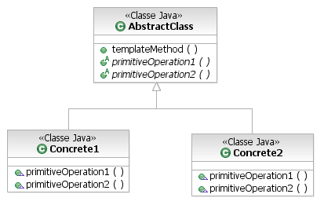

#Template Method

“O Padrão **Template Method** define o esqueleto de um algoritmo 
dentro de um método, transferindo alguns de seus passos para as subclasses. 
O Template Method permite que as subclasses redefinam certos passos de um 
algoritmo sem alterar a estrutura do próprio algoritmo”.

Exemplo:

##

Here are some examples of Template Methods in core Java libraries:

All non-abstract methods of 
[java.io.InputStream](https://docs.oracle.com/javase/8/docs/api/java/io/InputStream.html), 
[java.io.OutputStream](https://docs.oracle.com/javase/8/docs/api/java/io/OutputStream.html), 
[java.io.Reader](https://docs.oracle.com/javase/8/docs/api/java/io/Reader.html) and 
[java.io.Writer](https://docs.oracle.com/javase/8/docs/api/java/io/Writer.html).

All non-abstract methods of 
[java.util.AbstractList](https://docs.oracle.com/javase/8/docs/api/java/util/AbstractList.html), 
[java.util.AbstractSet](https://docs.oracle.com/javase/8/docs/api/java/util/AbstractSet.html) and 
[java.util.AbstractMap](https://docs.oracle.com/javase/8/docs/api/java/util/AbstractMap.html).

[javax.servlet.http.HttpServlet](https://docs.oracle.com/javaee/7/api/javax/servlet/http/HttpServlet.html), all the doXXX() methods by default send a HTTP 405 “Method Not Allowed” error as a response. You’re free to override any of them.

links:

https://sourcemaking.com/design_patterns/template_method/java/2